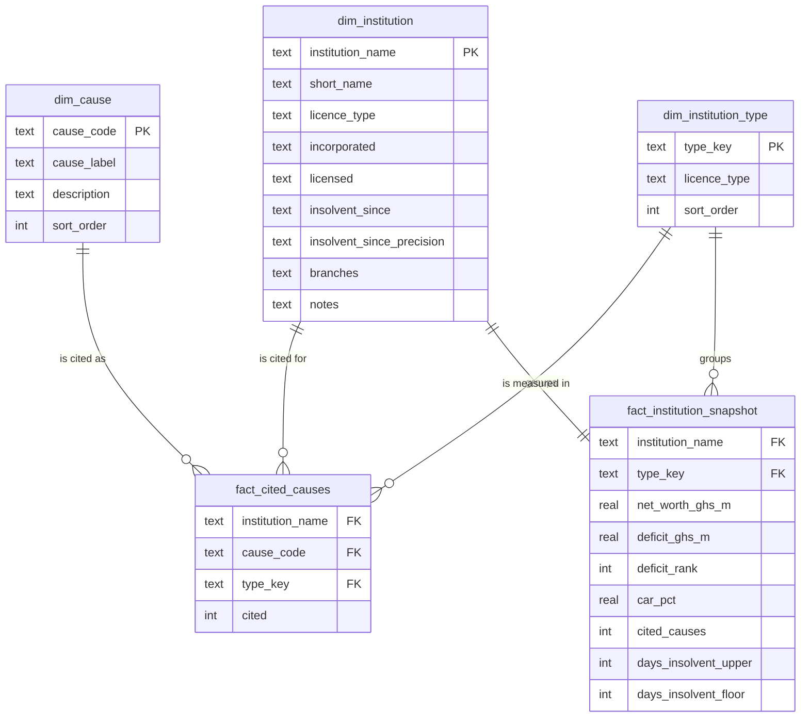

# BI data model

A star schema over the 23 savings and loans companies and finance houses revoked on 16 August 2019, built as SQL views in [`sql/bi/`](../sql/bi/). It exists so the same evidence can be sliced interactively without anyone recounting it by hand, and so every number on the dashboard can be traced to a query.

Nothing in the model is new data. Every view reads only the two tables that `sql/01_schema.sql` creates from the published CSVs. Drop the views and the database is exactly what `build_sqlite.py` produced.

## Running it

```bash
python scripts/build_sqlite.py
sqlite3 sql/ghana.db < sql/bi/01_dimensions.sql
sqlite3 sql/ghana.db < sql/bi/02_facts.sql
sqlite3 sql/ghana.db < sql/bi/03_marts.sql
sqlite3 sql/ghana.db < sql/bi/09_checks.sql
```

The last file should return 13 rows, every one beginning `OK`. If any reads `CHECK FAILED`, the model no longer reconciles to the loaded tables.

The views need SQLite 3.25 or later for window functions. The load route in `sql/02_load.sql` already needs 3.32.

## The schema



Two fact tables at two grains share three dimensions. Causes and money are kept apart because they are different kinds of fact: an institution is cited for several causes but has one net-worth figure, and putting both at one grain would repeat the money once per cause.

### Dimensions ([`01_dimensions.sql`](../sql/bi/01_dimensions.sql))

| View | Rows | Key | What it holds |
|---|---|---|---|
| `dim_institution` | 23 | `institution_name` | Short name matching the charts page, licence type, incorporation, licensing and insolvency dates as published, with the precision of each date, branches and notes |
| `dim_cause` | 10 | `cause_code` | The charts page's label for each cause, a description in the notice's terms, and the charts page's order |
| `dim_institution_type` | 2 | `type_key` | Savings and Loans, 16 institutions; Finance House, 7 |

The institution key is the name as published, which is already the primary key of `savings_loans`. At 23 rows a surrogate integer would add a lookup and nothing else.

### Facts ([`02_facts.sql`](../sql/bi/02_facts.sql))

| View | Grain | Rows | Measures |
|---|---|---|---|
| `fact_cited_causes` | One institution, one cause the Bank of Ghana cites for it | 101 | `cited`, always 1, so a sum is a count |
| `fact_institution_snapshot` | One institution, at revocation | 23 | Net worth, deficit and its rank, capital adequacy ratio, cited causes, days licensed while insolvent on two date readings |

`fact_cited_causes` is the unpivot that `10_failure_causes.sql` performs, kept as a view so every count of causes, pairs and causes by type comes from the same 101 rows.

`fact_institution_snapshot.cited_causes` is a pre-aggregated count from `fact_cited_causes`. It is carried on the snapshot so an institution's row is complete on its own, and `09_checks.sql` confirms it equals the published `cause_count` for all 23.

### Marts ([`03_marts.sql`](../sql/bi/03_marts.sql))

| View | Rows | Question |
|---|---|---|
| `v_cause_cooccurrence` | 100 | For every ordered pair of causes: of the institutions citing A, how many cite B, and of those not citing A, how many cite B? |
| `v_cause_by_type` | 20 | How often is each cause cited among savings and loans companies, and among finance houses? |
| `v_lag_by_cause` | 20 | For each cause, how long did the institutions citing it stay licensed while insolvent, against those not citing it? |

## Conventions carried over from the SQL layer

**A cause not cited is not a cause shown absent.** `fact_cited_causes` has a row where the notice states a cause and no row where it does not. The notice was written to justify a decision already taken, and silence in it is not evidence. The dashboard says "not cited", never "absent" or "no".

**NULL means the regulator published no figure.** Sterling has no net-worth figure and ASN's is positive, so 21 institutions carry a deficit. Commerz, First Ghana and GN have no stated insolvency date, so 20 carry an interval. None of these is filled in.

**Dates keep their precision.** The notice gives some dates to the day, some to the month and some to the year. `dim_institution` keeps each as published with a `*_precision` column. `fact_institution_snapshot` measures the insolvency interval on both readings a partial date allows:

| Reading | Year only | Month only | Median of the 20 |
|---|---|---|---|
| `upper`, as published | 1 January | the 1st | 927.5 days |
| `floor`, conservative | 31 December | the last day | 791.5 days |

An earlier insolvency date gives a longer interval to a fixed revocation date, so the published reading is the longest the notice permits, not the shortest. `12_supervisory_lag.sql` sets this out, rounding the two medians to 928 and 792.

## What was left out, and why

| Left out | Why |
|---|---|
| A region or geography dimension | The notice gives no region, town or branch location for the 23. Licence type is the only grouping the data supports. |
| A date dimension | Every institution has the same revocation date, 16 August 2019, and the other dates mix day, month and year precision. A calendar table would invite comparisons the dates cannot bear. |
| A warning date, and so a warning-to-revocation interval | The notice does not say when the Bank of Ghana first identified each problem. The only interval the record supports is stated insolvency to revocation. |
| The other 395 of the 418 closures | They carry a name, category, status and receiver but no stated causes or financials, so they cannot join the facts. They stay in `defunct_institutions`. |
| Deposits and depositor numbers | Not published per institution. See [`sourcing-deposits.md`](sourcing-deposits.md). |

## Using the model in a BI tool

The views are ordinary SQLite views, so once the files above have been run into `sql/ghana.db`, any tool that reads SQLite, directly or through an ODBC driver, sees them as tables.

When relating the tables, relate `dim_institution_type` to the two facts rather than to `dim_institution`. `dim_institution` carries `licence_type` as a label, and a second path from type to fact through it would make the filter ambiguous. Every relationship filters from dimension to fact. All are one to many except `dim_institution` to `fact_institution_snapshot`, which is one to one.

## Caveats

The caveats in the [main README](../README.md#caveats) apply in full. With n = 23, and groups as small as 6 or 7, nothing this model produces is a statistical result. It describes these institutions as the Bank of Ghana described them.
